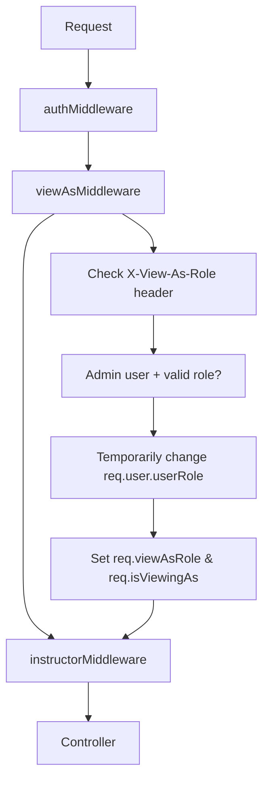

# Admin "View As" Testing Guide

## 🎯 **What's Been Fixed**

### **Backend Middleware Updates**

1. **Updated `instructorMiddleware.ts`** - Now allows admins viewing as instructors
2. **Updated `adminMiddleware.ts`** - Better error handling and consistent responses
3. **Added `viewAsMiddleware`** to all instructor route chains:
   - `instructorRouter/course.routes.ts`
   - `instructorRouter/batch.routes.ts`
   - `instructorRouter/test.routes.ts`

### **Frontend Integration**

1. **Axios interceptor** automatically adds `X-View-As-Role` header
2. **ViewAsContext** manages role switching and persistence
3. **RolePicker** provides UI for role selection

## 🔄 **How Admin View-As Works**

### **Middleware Chain Flow**



### **Frontend Header Injection**

```typescript
// In axios interceptor
const viewAsRole = getCurrentViewAsRole(); // From localStorage
if (viewAsRole && viewAsRole !== "admin") {
  config.headers["X-View-As-Role"] = viewAsRole;
}
```

### **Backend Role Processing**

```typescript
// In viewAsMiddleware
if (req.user.userRole === UserRole.ADMIN && viewAsRole) {
  req.user.userRole = requestedRole; // Temporarily change role
  req.viewAsRole = requestedRole;
  req.isViewingAs = true;
}

// In instructorMiddleware
const effectiveRole = getEffectiveUserRole(req); // Gets the view-as role
if (effectiveRole !== UserRole.INSTRUCTOR) {
  return res.status(403).json({ error: "Access denied" });
}
```

## 🧪 **Testing Instructions**

### **Step 1: Setup Admin User**

```bash
# Create admin user
cd nirudhyog-backend
node scripts/create-admin-user.js your-email@gmail.com "Your Name"

# Start all servers
cd nirudhyog-backend && npm run dev     # Terminal 1 (Backend)
cd nirudhyog-frontend && npm run dev    # Terminal 2 (Student Frontend)
cd admin-dashboard && npm run dev       # Terminal 3 (Admin Dashboard)
```

### **Step 2: Test Admin Login**

1. Go to `http://localhost:3001/sign-in`
2. Click "Continue with Google"
3. Use your admin Google account
4. Should redirect to admin dashboard (localhost:3002 or 3003)

### **Step 3: Test View-As Functionality**

#### **Test Instructor View**

1. In admin dashboard, click "Admin View" dropdown
2. Select "Instructor View"
3. Should stay on admin dashboard but show "Instructor View" in navbar
4. Navigate to any instructor page (courses, tests, etc.)
5. Should have full access without "Access Denied" errors

#### **Test Student View**

1. In admin dashboard, click "Instructor View" dropdown (if selected)
2. Select "Student View"
3. Should redirect to `http://localhost:3001` with admin banner
4. Banner should show: "You are viewing as a Student (Admin Mode)"
5. Click "Return to Admin Dashboard" to go back

#### **Test Recruiter View**

1. Select "Recruiter View" from dropdown
2. Should show recruiter interface in admin dashboard
3. Should have access to hiring/recruitment features

## 🔍 **Debugging Steps**

### **If "Access Denied" Appears**

#### **Check Browser Developer Tools**

```javascript
// In browser console, check:
localStorage.getItem("admin_view_as_role"); // Should show selected role
sessionStorage.getItem("adminToken"); // Should have admin JWT

// Check request headers in Network tab:
// Look for 'X-View-As-Role: instructor' header in API requests
```

#### **Check Backend Logs**

Look for these log messages:

```
 "Admin 123 viewing as instructor"
 "Access granted for instructor role (viewing as)"
 "Invalid view-as role requested"
 "Non-admin user attempted to use view-as functionality"
```

#### **Common Issues & Fixes**

**Issue**: Headers not being sent

```javascript
// Check axios interceptor is adding header:
console.log(
  "Current view-as role:",
  localStorage.getItem("admin_view_as_role"),
);
```

**Issue**: Role not persisted

```javascript
// Manually set role for testing:
localStorage.setItem("admin_view_as_role", "instructor");
// Then refresh page
```

**Issue**: Middleware chain wrong

```bash
# Check route files have correct middleware order:
grep -n "viewAsMiddleware" src/routes/instructorRouter/*.ts
```

## 🎨 **Expected Behavior**

### **Admin View (Default)**

- Full system access
- User management
- System settings
- All instructor + student + recruiter features

### **Instructor View (Admin viewing as Instructor)**

- Course management
- Student analytics
- Test creation and evaluation
- Batch management
- **NO access to admin-only features** (user management, system settings)

### **Student View (Admin viewing as Student)**

- Redirects to `localhost:3001`
- Shows admin banner
- Course browsing and enrollment
- Test taking
- Learning dashboard

### **Recruiter View (Admin viewing as Recruiter)**

- Job posting management
- Application reviews
- Candidate tracking
- Hiring analytics

## 📊 **API Endpoints Access Matrix**

| Endpoint Type           | Admin | Admin→Instructor | Admin→Student | Admin→Recruiter |
| ----------------------- | ----- | ---------------- | ------------- | --------------- |
| `/api/admin/*`          |       |                  |               |                 |
| `/api/instructor/*`     |       |                  |               |                 |
| `/api/student/*`        |       |                  |               |                 |
| `/api/hiring/*` (admin) |       |                  |               |                 |
| `/api/auth/*`           |       |                  |               |                 |

## 🔧 **Manual Testing Commands**

### **Test API Access with curl**

```bash
# Get admin token first
ADMIN_TOKEN="your-admin-jwt-token"

# Test instructor endpoint with view-as header
curl -H "Authorization: Bearer $ADMIN_TOKEN" \
     -H "X-View-As-Role: instructor" \
     http://localhost:3000/api/instructor/courses

# Should return courses data, not 403 error
```

### **Test Frontend Role Picker**

```javascript
// In browser console on admin dashboard:

// Check current view
const viewAsContext = window.__REACT_DEVTOOLS_GLOBAL_HOOK__?.renderers
  ?.get(1)
  ?.findFiberByHostInstance?.(
    document.querySelector('[data-testid="role-picker"]'),
  );

// Or check localStorage directly:
console.log("Current role:", localStorage.getItem("admin_view_as_role"));

// Manually trigger role change:
localStorage.setItem("admin_view_as_role", "instructor");
window.location.reload();
```

## **Success Criteria**

### **Admin should be able to:**

1.  Login and access admin dashboard
2.  Switch to "Instructor View" and access all instructor features
3.  Switch to "Student View" and be redirected to student dashboard
4.  Switch to "Recruiter View" and access hiring features
5.  Return to "Admin View" and access admin-only features
6.  No "Access Denied" errors when viewing as other roles

### **Non-admin users should:**

1.  Only see their own role view (no role picker)
2.  Get "Access Denied" if they try to access higher privilege endpoints
3.  Cannot use view-as functionality

## 🚀 **If Everything Works Correctly**

You should see:

- **No "Access Denied" errors** for admin users
- **Smooth role switching** in admin dashboard
- **Proper redirects** for student view
- **Consistent navigation** and feature access
- **Security maintained** (non-admins can't escalate privileges)

The admin role now has **complete access to every view** while maintaining proper security boundaries! 🎉
